  

<h1 align="center">Welcome to my GitHub Profile</h1>

  
  
  

  I design and build cross-platform experiences with C#, .NET, and Flutter. I care about performance, maintainability, and a great UX.

---

## Tech stack

  

---

## Highlights

- 🚀 Current focus: [wordpress_client](https://github.com/ArunPrakashG/wordpress_client)
- 💬 Ask me about: C#, .NET, MAUI/Xamarin, Flutter/Dart
- 📫 Reach me: [Email](mailto:arun.prakash.456789@gmail.com)

---

## At a glance

  
  

  

---

## Developer metrics

  <!-- lowlighter/metrics generated file -->
  

  <!-- WakaTime (via github-readme-stats) -->
  

<!-- Weekly coding breakdown (anmol098/waka-readme-stats will update between these markers) -->
<!--START_SECTION:waka-->
<!--END_SECTION:waka-->

---

## Activity graph

  
   
  Note: This is generated from public activity.
   

---

## Contribution snake

<picture>
  <source media="(prefers-color-scheme: dark)" srcset="charts/github-snake-dark.svg" />
  <source media="(prefers-color-scheme: light)" srcset="charts/github-snake.svg" />
  
</picture>

---

## Trophies

  

---

  Thanks for visiting! If you like something here, consider starring the repo or reaching out. ✨

